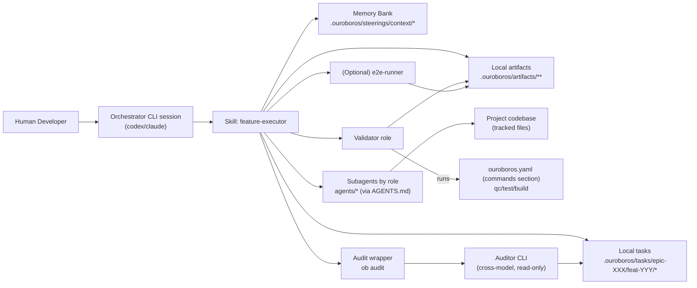
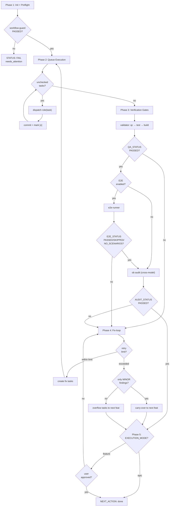

# Ouroboros: методология AI-assisted coding (file-based, multi-CLI)

Актуально для этого репозитория и набора `agents/*`.
Служит обзором процесса + картой ссылок.

Нормативные правила исполнения находятся в source-of-truth файлах:
- [Project Agent Entry](AGENTS.md) (entrypoint + read-first policy)
- [Role Contracts](AGENTS.md) (`*.agent.md`) — role contracts (see AGENTS.md Role-Based Required Context)
- [Stage Workflows](.ouroboros/steerings/context/methodology.context.md) (`*/SKILL.md`) — stage workflows (see section 1.1 Skills map below)
- [Policy Steerings](.ouroboros/steerings/instructions/) (`*.md`) — policy steerings
- `ouroboros.yaml (commands section)` (gate commands)

> **Примечание о путях:** steerings находятся в `.ouroboros/steerings/instructions/` и `.ouroboros/steerings/context/`. В source-репозитории методологии правки вносятся в исходники методологии (apm source directory), затем синхронизируются командой `apm run sync`. В satellite-проектах (где нет исходников методологии) путь `.ouroboros/steerings/` является единственным и canonical.

## Ключевые принципы

- **Труд и время человека дороже токенов** \
  Нужно минимизировать количество точек, где требуется внимание человека и увеличивать количество автоматизированных проверок.
  Нужно создавать циклы с обратной связью: давать агентам способы самостоятельно видеть ошибки и чинить их.
- **Нельзя доверять одной модели** \
  Модели склонны терять контекст и идти по кратчайшему (часто неправильному) пути.
  Каждое изменение кодовой базы должно проходить ревью моделью от другого вендора (часто не один раз).
- **Фиксация ошибок и рефлексия** \
  Совершать ошибки не страшно. \
  Важно их замечать, анализировать причины и стараться не допускать их в будущем.
- **Марафон, а не спринт** \
  Целевое применение методологии — проекты которые разрабатывались десятки лет до нее и должны развиваться десятки лет вместе с ней. \
  Инвестиции в качество важнее быстрого результата.
- **Постоянное улучшение** \
  В любом проекте копится технический долг и устаревшие решения. \
  Если на глаза попалось то что нужно исправить/усилить/провести рефакторинг — фиксируем задачу и делаем. \
  Даже если это имеет слабое отношение к текущей фиче.
- **Переносимость** \
  Методология рассчитана на разработку на любом языке программирования и стеке.
  Изначально python + docker, но нельзя делать из этого stack lock.
- **Методология тоже проект** \
  Любые изменения в методологии и ее компонентах должны проходить как отдельные фичи со всеми утвержденными этапами разработки (включая аудит другой моделью).

---

## 1) Карта артефактов (где что лежит)

### 1.1 Репозиторий (source of truth)

- **Entrypoint для агентов:** [Project Agent Entry](AGENTS.md) (для codex) и [Project Agent Entry (Claude)](CLAUDE.md) (для claude)
- **Knowledge / steerings:** `.ouroboros/steerings/context/` и `.ouroboros/steerings/instructions/` — canonical agent-facing steerings. Единый TOC и load-policy: [Project Agent Entry](AGENTS.md).
- **`.claude/`** — сгенерированные файлы `apm run init` / `apm run sync` (role-агенты, hooks, settings). Не редактировать напрямую.
- **Роли (контракты subagents):** [Project Agent Entry](AGENTS.md) — Role-Based Required Context (в satellite доступны через `.ouroboros/steerings/`)
- **Workflow-контракты (local-only, gitignored):** `.ouroboros/tasks/` (epic/feat/task/audit) — локальное состояние разработчика, не коммитится
- **Skills (стадии пайплайна):** available as named skills (see `AGENTS.md` TOC: Memory for list)
  - Pipeline skills (handoff chain):
    - `epic-creator` — создание эпика из draft.md/plan.md
    - `phase-researcher` — техническое исследование перед декомпозицией (опционально)
    - `feature-decomposition` — декомпозиция фичи на задачи с cross-model review (plan-checker → `ob review` retry-loop → `ob guard`)
    - `plan-checker` — семантическая валидация плана после декомпозиции (recommended; запускается в конце feature-decomposition)
    - `feature-executor` — основной end-to-end прогон фичи (5 фаз)
  - Gate skills (внутри feature-executor):
    - `qa-gate` — QA gate (qc + test + build)
    - `e2e-gate` — E2E gate (опционально)
    - `audit-gate` — аудит (cross-model, clean-room)
  - Pre-pipeline skills:
    - `brain-council` — collaborative brainstorming / Delphi method для проработки идей перед эпиком
    - `doc-search` — поиск актуальной документации библиотек и репозиториев
  - Utility/diagnostic skills:
    - `onboard` — инициализация project steerings в новом репозитории
    - `methodology-debugger` — post-session диагностика методологии (см. раздел 10)
    - `scientific-debugger` — structured hypothesis-driven debugging for non-obvious failures
    - `memory-groomer` — ревью memory/steerings (см. раздел 9.3)
    - `agent-browser` — browser automation для E2E и интерактивных проверок
    - `steering-creator` — создание и нормализация steerings
    - `skill-creator` — создание и оптимизация skills
    - `skill-validator` — валидация skill-файлов
    - `codestyle-mimic` — импорт code conventions из reference-репо
- **Violations (трекинг нарушений):** `.ouroboros/violations/issue-NNN.md` — отчёты methodology-debugger о найденных отклонениях от процесса. Lifecycle: обнаружение → документирование → эпик/фича на исправление → верификация аудитом. Архив: `.ouroboros/violations/old/`.
- **E2E-сценарии (сохранённые):** `.ouroboros/steerings/context/e2e-templates/` — шаблоны E2E-сценариев с parallel-safety контрактом (каждый сценарий должен быть независим для параллельного запуска).
- **Версионирование:** `.ouroboros/version.yaml` — трекинг `ouroboros_version`, `ob_version`, timestamps install/update.
- **Конфиги:**
  - `ouroboros.yaml` — **единственный источник правды** для `qc/test/build/e2e` (commands section), роутинга моделей (models section), execution environment (execution section)
- **Инструменты workflow:**
  - `apm run init` / `apm run sync` — генерация role-агентов, hooks, audit wrapper
  - `ob guard` — preflight guard для feature folder
- **Шаблоны артефактов:** [Task Templates](.ouroboros/steerings/context/task-templates.context.md)
- **Матрица CLI-ограничений:** [CLI Support](.ouroboros/steerings/context/cli-support.context.md)

### 1.2 Локальные runtime-артефакты (не коммитятся)

Эти пути **должны быть в `.gitignore`** и считаются локальным состоянием прогона:

- `.ouroboros/artifacts/` — логи gate'ов, метрики агентов, диагностические артефакты
- `.ouroboros/groomings/` — отчёты memory-groomer (`refine-NNN.md`)
- `.ouroboros/violations/` — отчёты methodology-debugger (`issue-NNN.md`)
- `.claude/`, `.codex/` — сгенерированные файлы `apm run init` / `apm run sync`
- `.ouroboros/tasks/**/.audit-*.tmp.md` — временные файлы audit wrapper (atomic writes)

### 1.3 Логи выполнения (для отладки)

- **CLI session logs** — session event log, transcript/trace files (path depends on active CLI)
- **Логи gate/обвязок в репо:**
  - `.ouroboros/artifacts/**` — все, что нужно для расследования "почему упало"
  - `.ouroboros/artifacts/epic-XXX/feat-YYY/audit-*.log` — объединённый лог аудиторского wrapper'а (stdout+stderr)
  - `.ouroboros/artifacts/context/agent-metrics.jsonl` — метрики subagents (role, duration, lines, tool_calls)
  - `.ouroboros/artifacts/context/compaction-events.jsonl` — события compaction контекста

---

## 2) Понятийная модель (слои)

### 2.1 Knowledge layer: Memory Bank

**Двуслойная архитектура steerings:**

- **Canonical agent-facing steerings:**
  - `.ouroboros/steerings/instructions/` — policy steerings
  - `.ouroboros/steerings/context/` — context/methodology steerings (включая этот файл)

Агенты загружают steerings через `.ouroboros/steerings/`. В satellite-репозиториях это единственно доступные и canonical пути.

В source-репозитории методологии правки вносятся в исходники методологии (apm source directory), затем синхронизируются через `apm run sync`.

Навигация по memory/steerings/roles выполняется только через [Project Agent Entry](AGENTS.md) (single TOC).
Промежуточные `index.md`-цепочки не используются в runtime workflow.

Критичные для исполнения:
- [Project Commands](.ouroboros/steerings/instructions/project-commands.instructions.md) — политика команд + источник правды `ouroboros.yaml commands section`
- [Workflow Safety](.ouroboros/steerings/instructions/workflow-safety.instructions.md) — scope guard + path policy + запреты на env dumps
- [Execution Conventions](.ouroboros/steerings/instructions/execution-conventions.instructions.md) — trusted execution и hygiene baseline
- [Decompose Conventions](.ouroboros/steerings/instructions/decompose-conventions.instructions.md) — требования к leaf-task контрактам
- [Role Selection](.ouroboros/steerings/instructions/role-selection.instructions.md) — детерминированный выбор роли для leaf-task'ов

### 2.2 Planning layer: Epic/Feat планы в Markdown

План = файловый контракт, который потом исполняется.

Структура (локально):

```text
.ouroboros/tasks/
  epic-XXX/
    draft.md
    plan.md
    feat-YYY/
      plan.md
      research.md       # (optional, from phase-researcher)
      task-NNN.md
      audit-NNN.md
```

**Конвенция task ID:** `task-NNN.md`, где `NNN` — трёхзначный номер задачи. Начальная декомпозиция: `task-001.md`, `task-002.md`, ... (без суффикса). Fix-задачи из fix-loop используют **следующий порядковый номер** (например после `task-003.md` → `task-004.md`, `task-005.md`). Подробности: [Task ID Suffix RFC](.ouroboros/steerings/instructions/task-id-suffix-rfc.instructions.md).

Планирующий слой обслуживают skills (см. разделы 4–6):
- `brain-council` — проработка идеи до формального планирования (опционально)
- `epic-creator` — формирует/обновляет `epic-XXX/{draft.md,plan.md}`
- `phase-researcher` — техническое исследование (опционально; dispatches agent role `researcher`)
- `feature-decomposition` — раскладывает `feat-YYY` на `plan.md` + `task-NNN.md` очередь
- `plan-checker` — семантическая валидация после декомпозиции (optional; вызывается в конце feature-decomposition, не является обязательным шагом перед feature-executor)

**Skill handoff chain:**

```
brain-council (opt) → epic-creator → phase-researcher (opt) → feature-decomposition → plan-checker (opt) → feature-executor
```

Handoff contract:
- **Не-ветвящиеся skills** (`plan-checker`, `phase-researcher`) выводят `NEXT_SKILL: <skill_name>` в машинном футере безусловно
- **Ветвящиеся skills** (`epic-creator`, `feature-decomposition`, `qa-gate`, `e2e-gate`) имеют условные следующие шаги (либо вызывают subagent inline, либо ждут решения оператора) и **не** эмитят поле `NEXT_SKILL` в футере
- `feature-decomposition` запускает `plan-checker` как in-skill clean-room subagent (step 10) до завершения skill; downstream feature-executor — это операторское решение, а не автоматическая chain
- `NEXT_SKILL` — runtime-actionable routing signal; orchestrator/user читает его для определения следующего шага
- `NEXT_SKILL` advisory: orchestrator может пропустить или заменить по состоянию workflow
- `feature-executor` — terminal skill, не имеет `next_skill:`

**Skill routing:**

Orchestrator matches natural language user requests to skills. Routing rules and example trigger phrases are defined in [Orchestrator Trigger Routing](.ouroboros/steerings/instructions/orchestrator-trigger-routing.instructions.md).

### 2.3 Execution layer: Orchestrator + subagents

Orchestrator (skill `feature-executor`) читает `feat-YYY/plan.md` и выполняет очередь строго по `## Tasks (queue)`, делегируя работу subagents по ролям. Orchestrator не реализует код напрямую — только координация.

`feature-executor` работает в **5 фазах** (подробнее в разделе 6):

1. **Init + Preflight** — валидация feature path, запуск workflow-guard (plan-checker опционален — запускается в конце feature-decomposition, не в preflight)
2. **Queue Execution** — последовательный dispatch задач по ролям, коммиты, обновление очереди
3. **Verification Gates** — validator (QA) → e2e-runner (optional) → auditor (via `ob audit`)
4. **Fix-loop** — классификация failures, создание fix-задач, re-run фаз 2–3 (лимит: 3 retry)
5. **Human Approval / Auto-Proceed** — итоговый summary; в feature mode — блокировка до подтверждения пользователем; в epic mode — auto-proceed без ожидания

**Sequential execution policy:** фичи из `## Feature Queue` эпика выполняются строго последовательно — по одной, в порядке очереди. Параллельное выполнение фич не поддерживается в текущей архитектуре.

### 2.4 Quality gates layer: Validator → (E2E) → Auditor

- **Validator** — единственный источник правды для `QA_STATUS` и `TEST_STATUS`.
- **E2E (опционально)** — отдельная роль (`e2e-runner`) при включении `commands.e2e_enabled=true`.
- **Auditor** — clean-room проверка архитектуры/best-practice + reconciliation feature DoD.
  Аудитор **не запускает тесты** и не определяет `TEST_STATUS` (он наследуется от validator).
  Причина: аудит выполняется в read-only режиме проверки артефактов, поэтому тесты и статусы гейтов централизованы в роли `validator`.

**Audit independence policy:** аудитор **обязательно** запускается на другом CLI/модели, чем orchestrator (enforced через `ob audit` wrapper). Пример: orchestrator=claude → auditor=codex. Cross-model аудит выявляет model-specific слепые зоны. Конфигурация: `ouroboros.yaml` → `execution.orchestrator_cli` / `execution.auditor_cli`.

**Cross-model review:** помимо аудита, cross-model review применяется на этапах планирования — `epic-creator` и `feature-decomposition` используют `ob review` для рецензии другой моделью (конфигурация: `execution.reviewer_cli`, fallback на `execution.auditor_cli`). Поведение различается по скиллу: для `epic-creator` review остаётся one-shot (коррекции применяются в текущей сессии без повторных итераций); для `feature-decomposition` review итеративный — цикл review → fix → re-review до 3 раз до достижения PASS, после чего эскалируется к пользователю.

### 2.5 Model tiering

Методология использует двухуровневую систему моделей, настраиваемую в `ouroboros.yaml (models section)`:

| Тир | Назначение | Роли |
|-----|-----------|------|
| **smart** | Задачи с высокой неопределённостью, аудит, архитектурные решения | `auditor`, `swe-smart` |
| **workhorse** | Стандартные задачи, валидация, тесты, документация | `swe-workhorse`, `validator`, `test-writer`, `doc-writer`, `e2e-runner` |

Каждый тир определяет модель и effort level для каждого поддерживаемого CLI (claude/codex). Smart-тир использует более мощные модели с максимальным effort; workhorse — более быстрые модели с умеренным effort.

`audit_independence: true` — enforced правило: auditor_cli != orchestrator_cli.

---

## 3) Роли и зоны ответственности

Источник контрактов: role contracts (loaded via `AGENTS.md` Role-Based Required Context).

| Роль | Тир | Основное назначение | Разрешённые изменения | Команды (policy) |
|---|---|---|---|---|
| `swe-workhorse` | workhorse | Контрактное выполнение leaf-task при ясном пути реализации (default) | код/конфиг/тесты/доки в `File Scope` | обычно `qc` |
| `swe-smart` | smart | Leaf-task с технической неопределённостью: выбор подхода/компромиссов и реализация | код (и связанный wiring в `File Scope`, если это в DoD) | обычно `qc` |
| `test-writer` | workhorse | Тесты и только тесты | тесты в `File Scope` | (не gate) |
| `doc-writer` | workhorse | docs/memory | docs в `File Scope` | (не gate) |
| `validator` | workhorse | QA gate | не правит прод-код; пишет `.ouroboros/artifacts/*` | **`qc → test → build`** строго по `ouroboros.yaml commands section` |
| `e2e-runner` | workhorse | E2E gate | пишет `.ouroboros/artifacts/*` | `e2e` по `ouroboros.yaml commands section` |
| `auditor` | smart | Архитектура/best practices + DoD фичи | только `.ouroboros/tasks/*` артефакты аудита/DoD | **команд нет** (read-only) |

Правила:
- Orchestrator не реализует код напрямую — только координация и обновление локальных артефактов.
- Выбор роли делается на стадии `feature-decomposition` при формировании `feat-YYY/plan.md` → `## Tasks (queue)` по правилам [Role Selection](.ouroboros/steerings/instructions/role-selection.instructions.md).
- `task → role` берётся **только** из строки очереди в `feat-YYY/plan.md`; `feature-executor` не переопределяет роль.
- Doc hygiene (frontmatter + annotated internal links) нормируется [Documentation Hygiene](.ouroboros/steerings/instructions/documentation-hygiene.instructions.md) и должна соблюдаться ролью `doc-writer`.
- **DoD ownership:** task-level DoD обновляется исполняющей ролью и `validator`; feature-level DoD обновляется **только** `auditor` во время аудита.

---

## 4) Фаза A: Подготовка драфта

Драфт эпика — единственный входной артефакт, который готовит **человек**. Методология не предписывает формат драфта, но предоставляет инструменты для проработки:

**Skill `brain-council`** (опциональный) — collaborative brainstorming для проработки идей:
- **Default mode (solo):** агент задаёт уточняющие вопросы (min 2), предлагает подходы, формирует spec по секциям с одобрением пользователя.
- **Council mode (по явному запросу):** multi-model Delphi deliberation с анонимной агрегацией feedback, Six Thinking Hats review structure.
- **Hard gate:** brain-council **не пишет код** — только design document (`specs/YYYY-MM-DD-<topic>-brainstorm.md`).

**Skill `doc-search`** (опциональный) — поиск актуальной документации библиотек и репозиториев. Полезен для уточнения API, паттернов, ограничений.

Результат фазы: `draft.md` — неструктурированный документ с идеей, контекстом, ограничениями и открытыми вопросами. Размещается в `.ouroboros/tasks/epic-XXX/draft.md` (может быть создан вручную или через `brain-council`).

---

## 5) Фаза B: Планирование (epic → decomposition → validation)

Фаза превращает драфт в исполняемые контракты. Состоит из 4 шагов:

### 5.1 Создание эпика (`epic-creator`)

Skill `epic-creator` принимает `draft.md` и/или `plan.md` и формирует структуру:

```text
.ouroboros/tasks/epic-XXX/
  draft.md    # неструктурированный контекст
  plan.md     # формальный план: Scope, DoD, Feature Queue, Decisions, Refs
```

Варианты:
- Есть только draft → генерируется plan.md по шаблону из [Task Templates](.ouroboros/steerings/context/task-templates.context.md)
- Есть оба → reconciliation противоречий

Опциональный шаг: **cross-model review** через `ob review` — рецензия плана другой моделью на полноту, противоречия и потенциальные проблемы. One-shot: коррекции применяются в текущей сессии без цикла повторных рецензий.

### 5.2 Техническое исследование (`phase-researcher`, опционально)

Если фича затрагивает незнакомые библиотеки, API или есть техническая неопределённость:

- Исследование через doc-search skill, web search
- Findings с уровнями уверенности: HIGH, MEDIUM, LOW
- Результат: `feat-YYY/research.md`
- Если есть unresolved findings с LOW confidence → `NEXT_ACTION: needs_more_research` (декомпозиция может продолжиться с осторожностью)

### 5.3 Декомпозиция фичи (`feature-decomposition`)

Раскладывает одну фичу из `epic-XXX/plan.md` на исполняемые задачи:

1. **Structured ambiguity scan** — 10 категорий (Scope, Behavior, Data, Error handling, Performance, Security, Edge cases, Integration, UX, Priority); до 3 раундов уточняющих вопросов по 5 вопросов
2. **Генерация `feat-YYY/plan.md`** — human_title, Goal, Definition of Done, Refs, Tasks (queue)
3. **Генерация `task-NNN.md` файлов** — каждый с Spec, DoD, Dependencies, File Scope, Constraints, Refs
4. **Назначение ролей** — по правилам [Role Selection](.ouroboros/steerings/instructions/role-selection.instructions.md)
5. **Валидация** — queue consistency, dependency DAG, отсутствие циклов
6. **Cross-model review** — `ob review <feat-path>` итеративная рецензия плана другой моделью (retry-loop, max 3 итерации); коррекции применяются к `feat-YYY/plan.md` и `task-NNN.md` до достижения PASS либо эскалации.
7. **Workflow guard** — `ob guard <feat-path>` preflight; декомпозиция заканчивается здесь, далее `plan-checker`.

Формат очереди в `feat-YYY/plan.md`:

```md
- [ ] [task-001.md](.ouroboros/tasks/epic-XXX/feat-YYY/task-001.md) | swe-workhorse | <short title>
```

### 5.4 Валидация плана (`plan-checker`, optional)

Семантическая проверка по 8 измерениям (5 баллов каждое, max 40):

1. **Requirement coverage** — каждый пункт feature DoD покрыт ≥1 задачей
2. **File scope sanity** — max 8 файлов/задача, ~600 строк, ≤3 подсистемы
3. **Dependency correctness** — DAG ацикличен, все refs существуют, очередь respects order
4. **Key links planned** — новые артефакты имеют шаг wiring (не только создание)
5. **Test coverage mapping** — каждое behavioral requirement имеет запланированный тест
6. **Mirage detection** — assertions плана проверяются через code/config inspection (10 паттернов: phantom APIs, version mismatches, hallucinated paths, schema mismatches и др.)
7. **Path policy** — все `Refs` и `File Scope` во всех task-файлах используют repo-relative пути (без `./`, абсолютных путей, `$HOME`, `$(pwd)`, `../`)
8. **Refs completeness** — все необходимые ссылки присутствуют в task-файлах

Scoring:
- Все 8 измерений прошли И score ≥34: `NEXT_ACTION: start_act` — план готов к исполнению
- Любое измерение не прошло или score 24–33 (iteration < 3): `NEXT_ACTION: refine_decomposition` — доработка и повторная проверка
- iteration ≥3 и всё ещё failing, или score < 24: `NEXT_ACTION: needs_attention` — эскалация на человека

`plan-checker` запускается автоматически в конце `feature-decomposition` (step 10 in-skill clean-room subagent). Для ручного запуска перед feature-executor — доступен как отдельная skill. Результат `PLAN_CHECK_STATUS=FAILED` при ручном запуске означает рекомендацию доработать план, но не блокирует `feature-executor` автоматически.

---

## 6) Фаза C: Исполнение (feature-executor)

Запуск: через slash-command `/act` или напрямую через skill `feature-executor` с указанием feature path.

Эпик может исполняться целиком (все фичи последовательно) или по одной фиче за раз.

### 6.0 Slash-command `/act` и режимы исполнения

**Синтаксис:** `/act <path>`, где `<path>` — путь к директории эпика или фичи (например, `epic-011` или `epic-011/feat-004`).

**Определение режима по пути:**

| Аргумент | Режим | Пример |
|----------|-------|--------|
| `epic-NNN` (без `feat-`) | `EXECUTION_MODE: epic` | `epic-011` |
| `...feat-NNN` (содержит `feat-`) | `EXECUTION_MODE: feature` | `epic-011/feat-004` |

Если аргумент пустой или не соответствует ни одному паттерну — команда останавливается и просит ввести корректный путь.

**Поведение в режиме `feature`:**

- Запускает skill `feature-executor` для одной указанной фичи.
- После завершения фичи (Phase 5) ждёт подтверждения пользователя перед любыми дальнейшими действиями.

**Поведение в режиме `epic`:**

- Читает `## Feature Queue` из `plan.md` эпика.
- Выполняет все незавершённые фичи (`- [ ]`) последовательно через skill `feature-executor`, в порядке очереди.
- **Auto-progression:** между фичами не требуется ручное подтверждение — orchestrator переходит к следующей фиче автоматически.
- **Условия остановки:** все фичи выполнены (`STATUS: done`) **или** возникла неустранимая ошибка (`STATUS: FAIL` без пути к fix).
- После завершения всей очереди (или аварийной остановки) выводится итоговый summary пользователю.

**Отличие от feature-режима:** в feature-режиме Phase 5 блокирует исполнение и ждёт одобрения пользователя. В epic-режиме Phase 5 каждой фичи завершается автоматическим переходом к следующей (пока не исчерпана очередь или не возникла ошибка).

Полная спецификация режимов: the feature-executor skill contract.

### 6.1 Phase 1: Init + Preflight

- Валидация: feature path существует, очередь parseable, все task-файлы на месте
- Запуск `workflow-guard` (preflight guard)
- `plan-checker` — опционально; рекомендуется запускать в конце `feature-decomposition`, не в preflight
- Resolve/создание feature branch
- Загрузка epic + feature context

При любом fail → `STATUS: FAIL`, `NEXT_ACTION: needs_attention`.

### 6.2 Phase 2: Queue Execution

Для каждой невыполненной задачи из `## Tasks (queue)`:
- Subagent читает `Spec/DoD/Dependencies/File Scope/Constraints/Refs`
- Делает изменения в пределах `File Scope`
- Выполняет `qc` (если применимо по роли/стеку)
- Возвращает машинный результат в orchestrator
- Orchestrator коммитит изменения (один commit на leaf-task)
- Orchestrator отмечает задачу `[x]` и дописывает `| commit=<sha>`

**Параллельное выполнение (hint-driven):** если `plan.md` Notes помечают задачи как parallelizable (непересекающийся `File Scope`), orchestrator **обязан** запустить их параллельно (multiple Agent tool calls). Safety-check: file-level overlap + shared resources (`pyproject.toml`, `package.json`, `settings.py`, `constants.*`, `__init__.py`, `index.ts`). Без явной пометки — последовательный режим.

### 6.3 Phase 3: Verification Gates

После выполнения всей очереди:

1. **Validator** выполняет gate по `ouroboros.yaml (commands section)`:
   - `commands.qc` → `commands.test` → `commands.build` (stop on first failure)
   - Результат: `QA_STATUS`, `TEST_STATUS`
2. **(Опционально) E2E-runner**, если `commands.e2e_enabled=true`:
   - Прекондиция: `QA_STATUS=PASSED`
   - Результат: `E2E_STATUS`
3. **Auditor** (clean-room, cross-model):
   - Dispatch через `ob audit .ouroboros/tasks/epic-XXX/feat-YYY` (не через Agent/subagent call)
   - Прекондиция: `QA_STATUS=PASSED`, опционально `E2E_STATUS in {PASSED, SKIPPED, NO_SCENARIOS}`
   - Clean-room: prompt содержит только feature path, gate markers и raw prior audit files (никакого narrative context от orchestrator)
   - Результат: `audit-NNN.md`, `AUDIT_STATUS`

Условия успеха фичи:
- `QA_STATUS=PASSED`
- `TEST_STATUS in {PASSED, SKIPPED}`
- `AUDIT_STATUS=PASSED`
- `FEATURE_DOD_STATUS=UPDATED`

### 6.4 Phase 4: Fix-loop

Триггеры: любой gate вернул `FAILED` или `ERROR`.

Политика:
- Классификация: functional failure vs infra failure (infra → backoff, не fix-задачи)
- Fix оформляется как новые leaf-task файлы в `feat-YYY/` и добавляются в `## Tasks (queue)`
- После фикса — re-run фаз 2–3 (validator → e2e → audit)
- **Retry limit: 3** — при превышении → Phase 5 с `STATUS: FAIL` или overflow
- Запрещён "evidence-based PASS": если validator не смог выполнить команды, это `ERROR/infra`, а не `PASSED`

**Overflow mechanism:** если retry limit исчерпан, но findings есть:
- Remaining findings переносятся как overflow-задачи в **следующую фичу** из epic queue
- Если следующей фичи нет (последняя фича в эпике) — **запрашивается решение пользователя**: (a) создать `feat-(YYY+1)` с overflow-задачами, (b) принять текущее состояние и закрыть фичу как есть, (c) ручное вмешательство. Цикл повторяется после каждого аудита, пока findings не исчезнут или пользователь не остановит процесс
- **Minor-only carry-over** (условие: следующая фича существует): если последний audit содержит только MINOR findings (нет CRITICAL/MAJOR) — они переносятся целиком в следующую фичу без исчерпания retry limit. Если следующей фичи нет — MINOR carry-over не применяется, используется user-prompt overflow выше
- Решение о переносе фиксируется в `## Session State` → `DECISIONS`

### 6.5 Phase 5: Human Approval (feature mode) / Auto-Proceed (epic mode)

- Итоговый summary: gate markers, DoD status, изменённые файлы
- **Feature mode:** блокировка выполнения до подтверждения пользователем; если requested changes → новые fix-задачи, возврат в Phase 4
- **Epic mode:** без ожидания одобрения — auto-proceed к merge и следующей фиче
- После прохождения фазы → orchestrator выполняет merge и cleanup:
  - Merge feature branch: `git merge --no-ff feature/epic-NNN-feat-YYY -m "feat: <human_title>"`
  - Удаление feature branch: `git branch -d feature/epic-NNN-feat-YYY`
  - Подробности: the feature-executor skill contract, Phase 5
- После merge → `NEXT_ACTION: done`

### 6.6 Конвенция префиксов коммитов

- `feat: ...` — новый функционал (по умолчанию для очереди фичи)
- `fix: ...` — фиксы по результатам gate'ов/аудита/валидации
- `test: ...` — изменения только в тестах
- `doc: ...` — документация / Memory Bank / методология
- `val: ...` — изменения QA/gate-инфры (`ouroboros.yaml (commands section)`, gate scripts)
- `audit: ...` — изменения audit-инфры (не audit reports)

Правила:
- один leaf-task = один commit
- `validator` и `auditor` не коммитят; коммиты делает исполнитель leaf-task роли
- **Запрет ID в сообщениях коммитов/merge:** commit и merge messages не должны содержать epic/feat/task ID. Правильно: `feat: human-readable feature title`. Неправильно: `feat(epic-003/feat-001): ...` или `Merge develop: feat-006, feat-007`. Это относится как к обычным коммитам, так и к merge-коммитам.

---

## 7) Trusted execution и доверительные предпосылки

Источник: [Execution Conventions](.ouroboros/steerings/instructions/execution-conventions.instructions.md).

### 7.1 Базовое правило

- По умолчанию workflow использует trusted execution на рабочей станции:
  - команды выполняются без автоматического ожидания sandbox-прохождения;
  - для поддерживаемых CLI (`codex`, `claude`) разрешён прямой доступ к локальным и удалённым сетевым вызовам.
- Произвольные outbound network-вызовы допустимы, если выполняются по правилам:
  - `network`/`artifact` hygiene из [Workflow Safety](.ouroboros/steerings/instructions/workflow-safety.instructions.md),
  - безопасность секретов из [Workflow Safety](.ouroboros/steerings/instructions/workflow-safety.instructions.md).
- CLI launch-профили используются для детерминированности запуска, но **не** являются gate безопасности/подтверждения для корректности workflow по умолчанию.

### 7.2 Что меняется в аварийных случаях

- Если есть локальные ограничения среды/CLI, они должны быть зафиксированы в workflow-инцидентах, а task-конфигурация или артефакты запуска — скорректированы. Переход в альтернативный режим исполнения не допускается.
- Аудитор всегда остаётся **read-only** (без изменения прод-кода, без запуска тестов). Это оговаривается его контрактом и не может быть переопределено ситуативно.
- **Принцип "спросить пользователя":** при наличии инфраструктурных проблем, если стоит выбор между "нарушить контракты ролей / сделать вид что задача выполнена" и "остановиться, спросить пользователя и возможно потерять время" — всегда выбирать "спросить пользователя".

### 7.3 Обязательные запреты

- Нельзя публиковать полный ENV через `env | sort` / `printenv` / `set` в ответах или артефактах.
- Нельзя делать широкие сканы домашней системы (`rg /Users`, `find /`, etc.) без явного разрешения в `Refs`.

---

## 8) Hooks (cross-CLI)

`apm run init` генерирует hooks для поддерживаемых CLI. Hook-скрипты — дополнительный слой защиты поверх gate'ов.

### 8.1 Реестр hook-скриптов

Все скрипты в `.apm/hooks/scripts/`:

| Скрипт | Trigger | Назначение | Exit |
|--------|---------|-----------|------|
| `subagent-qc.cjs` | SubagentStop, Stop, PostToolUse | Multi-stage QC: git staging guard (BLOCK), monolithic command guard, plan.md read-before-edit, prompt contamination, absolute path guard. Запускает QC из `ouroboros.yaml` | exit 2 → feedback в контекст модели |
| `subagent-audit-guard.cjs` | SubagentStop | Блокирует выполнение аудита как обычного subagent (должен идти только через `ob audit`). Ищет `AUDIT_STATUS` или `ROLE: auditor` в транскрипте | exit 2 → AUDIT_GUARD_VIOLATION |
| `context-monitor.cjs` | PostToolUse | Мониторинг оставшегося контекста. Warning ≤35%, Critical ≤25%. Debounce: 5 tool_use между warnings | exit 0 (warning via stderr) |
| `statusline.cjs` | Notification | Отображение в statusline: model, current task, directory, context usage bar. Пишет metrics bridge для context-monitor. `ob update` дополнительно генерирует top-level `statusLine` в `.claude/settings.json` для визуального отображения в Claude CLI | exit 0 |
| `bash-safety.cjs` | PostToolUse | Warning при 2+ мутирующих операциях в одной bash-команде (rm, mv, git add/commit, sed -i и др.) | exit 0 (warning only) |
| `agent-metrics.cjs` | SubagentStop | Сбор метрик subagents: line count, token count, tool_use calls, ROLE detection. Append в `.ouroboros/artifacts/context/agent-metrics.jsonl` | exit 0 |
| `post-compact.cjs` | PostCompact | При compaction контекста — инъекция recovery instruction для восстановления позиции в очереди через feature-executor. Log в `compaction-events.jsonl` | exit 2 → recovery instruction |

### 8.2 Stop hook (Claude + Codex)

QC из `ouroboros.yaml commands section` запускается автоматически перед завершением сессии на обоих CLI.
- Claude: `.claude/settings.json` → `Stop` event
- Codex: `.codex/hooks.json` → `Stop` event

Anti-loop: `stop_hook_active` в payload предотвращает повторный запуск QC при блокирующем exit.

### 8.3 Hook parity table

| Hook Event | Claude | Codex | Enforcement |
|------------|--------|-------|-------------|
| Stop (QC) | yes | yes | Runtime (hook) |
| PreToolUse (staging guard + monolithic guard) | yes | yes (experimental) | Runtime (hook) — Codex via `codex_hooks` |
| PostToolUse (bash safety + QC on Edit) | yes | yes (experimental) | Runtime (hook) — Codex via `codex_hooks`; `context-monitor.cjs` remains Claude-only |
| SubagentStop (QC + audit guard + metrics) | yes | no | Claude: hook; Codex: prompt instruction |
| PostCompact (recovery instruction) | yes | no | Claude-only |
| Notification (statusline bridge) | yes | no | Claude-only: `statusline.cjs` пишет `current.json` телеметрию; визуальный дисплей — top-level `statusLine` в `.claude/settings.json` |

> Codex PreToolUse/PostToolUse support is experimental (`codex_hooks` feature, codex-cli 0.114.0+). See [CLI Support](.ouroboros/steerings/context/cli-support.context.md) for version reference and known limitations.

Полная матрица CLI-возможностей: [CLI Support](.ouroboros/steerings/context/cli-support.context.md).

Требования: Node.js в PATH. Для отключения: удалить записи из `.claude/settings.json` или не запускать `apm run init`.

---

## 9) Наблюдаемость (как быстро понять "что сейчас происходит")

### 9.1 Где смотреть статус фичи

- `.ouroboros/tasks/epic-XXX/feat-YYY/plan.md`
  - очередь задач (`[ ]` vs `[x]`)
  - роли (source of truth)
  - `commit=<sha>` как линк на историю кода
  - `## Session State` — текущая позиция, счётчики, решения

### 9.2 Где смотреть результаты gate'ов

- `.ouroboros/artifacts/**/qa-*.log` — вывод validator
- `.ouroboros/artifacts/**/e2e-*.log` — вывод e2e-runner (если есть)
- `.ouroboros/tasks/epic-XXX/feat-YYY/audit-NNN.md` — вывод аудитора (auditor пишет в stdout, `ob audit` wrapper захватывает вывод и записывает файл)
- `.ouroboros/artifacts/epic-XXX/feat-YYY/audit-*.log` — почему audit wrapper упал (если упал)

### 9.3 Violations и диагностика

- `.ouroboros/violations/issue-NNN.md` — отчёты methodology-debugger с dashboard здоровья сессии (метрики, findings по категориям, рекомендации)
- `.ouroboros/groomings/refine-NNN.md` — отчёты memory-groomer (12 измерений: CLI parity, duplicate rules, context bloat, stale names и др.)
- `.ouroboros/artifacts/context/agent-metrics.jsonl` — метрики subagents (role, duration, lines, tool_calls)

Ответственные skills:
- `methodology-debugger` — поиск проблем в workflow (post-session)
- `memory-groomer` — поиск проблем в steerings и памяти

---

## 10) Post-session проверка методологии (обязательная)

После завершения прогона (успех или fail-stop) делаем пост-проверку на соответствие процессу:

- запускаем skill `methodology-debugger`,
- он анализирует артефакты текущей CLI-сессии, состояние репозитория и рабочие артефакты,
- использует CLI-specific asset files (from methodology source) (выбор CLI-варианта — автоматический по типу анализируемой сессии),
- и создаёт следующий отчёт `.ouroboros/violations/issue-XXX.md`.

Цель: быстро поймать регрессии (утечки ENV/секретов, evidence-based PASS, ошибки `.ouroboros/tasks/` контрактов) и упрощать отладку пайплайна.

---

## 11) Диаграммы (Mermaid)

### 11.1 Компонентная карта (кто кого вызывает и где лежат артефакты)



### 11.2 Полный lifecycle фичи (5 фаз feature-executor)



### 11.3 Sequence: прогон одной фичи

```mermaid
sequenceDiagram
  participant U as Human
  participant O as Orchestrator (feature-executor)
  participant G as workflow-guard
  participant Q as feat plan (queue)
  participant SA as Subagent (role)
  participant V as Validator
  participant EG as e2e-gate
  participant AU as ob audit wrapper
  participant AD as Auditor (cross-model)

  U->>O: run feature-executor @.ouroboros/tasks/epic-XXX/feat-YYY
  O->>G: guard(feature)
  G-->>O: PASS/FAIL
  alt guard FAIL
    O-->>U: stop (blocker)
  else guard PASS
    loop while queue has unchecked tasks
      O->>Q: read next task + role
      O->>SA: ROLE: <role-id> + task contract
      SA-->>O: footer STATUS + changed files
      O->>O: commit + mark [x] + sha
    end
    O->>V: run qc/test/build
    V-->>O: QA_STATUS + TEST_STATUS
    alt QA not PASSED
      O-->>U: enter fix-loop
    else QA PASSED
      O->>EG: e2e-gate (run/skip decision)
      EG-->>O: E2E_STATUS
      alt E2E_STATUS in FAILED or ERROR
        O-->>U: enter fix-loop
      else E2E_STATUS PASSED or SKIPPED or NO_SCENARIOS
        O->>AU: ob audit feat-YYY
        AU->>AD: clean-room prompt (no narrative)
        AD-->>AU: stdout (audit report content)
        AU->>AU: capture stdout → audit-NNN.md
        AU-->>O: AUDIT_STATUS
        alt AUDIT_STATUS=PASSED
          O-->>U: Phase 5 summary (feature mode: await approval; epic mode: auto-proceed)
        else AUDIT_STATUS=FAILED
          O-->>U: enter fix-loop or overflow
        end
      end
    end
  end
```

### 11.4 Gate markers (минимальный набор)

Gate markers — это строки (не JSON) в отчётах/футерах, чтобы их было легко парсить:

- `QA_STATUS: PASSED|FAILED|ERROR_INFRA|SKIPPED`
- `DET_STATUS: PASSED|FAILED|ERROR_INFRA|SKIPPED` (validator only; deterministic unit stage)
- `INT_STATUS: PASSED|FAILED|ERROR_INFRA|SKIPPED` (validator only; integration/runtime stage)
- `INFRA_SIGNATURE: <none|DOCKER_SOCK_DENIED|DOCKER_DAEMON_UNAVAILABLE|BUILDX_ACTIVITY_DENIED|SANDBOX_DENIED|...>` (validator only; stable infra fingerprint)
- `TEST_STATUS: PASSED|FAILED|ERROR|SKIPPED`
- `E2E_STATUS: PASSED|FAILED|ERROR|SKIPPED|NO_SCENARIOS`
- `AUDIT_STATUS: PASSED|FAILED|ERROR|SKIPPED`
- `FEATURE_DOD_STATUS: UPDATED|INCOMPLETE|SKIPPED`

Шаблон audit report: [Task Templates](.ouroboros/steerings/context/task-templates.context.md) → `Template: feat-YYY/audit-NNN.md`.

---

## 12) Возможные улучшения (Possible Improvements)

> Это направления для будущих исследований и улучшений, **не** часть текущего scope (epic-006). Основано на результатах исследования prompt caching: [Research: Prompt Caching](.ouroboros/tasks/epic-005/feat-012/research-prompt-caching.md).

1. **OTEL observability для реконструкции порядка чтения файлов.** События `tool_result` содержат `event.sequence`, `tool_parameters` (file paths) и `prompt.id`, что позволяет восстановить порядок чтения файлов сабагентами. Skill `methodology-debugger` может использовать эти данные вместо парсинга сырых логов.

2. **Cache hit rate как индикатор стабильности steerings.** Если `apm run sync` вызывает падение cache hit rate — значит [CLAUDE.md](CLAUDE.md)/[AGENTS.md](AGENTS.md) изменились слишком сильно и все сабагенты получают cache misses. Этот показатель можно мониторить через OTEL dashboard как сигнал о нежелательных изменениях в steering-документах.

3. **Недетерминированный порядок чтения файлов сабагентами.** Два сабагента одной роли могут читать Refs в разном порядке, теряя cache hits после расхождения общего префикса. Это релевантно при анализе аномально высокого расхода токенов — разный порядок чтения может быть причиной неожиданных cache misses.

4. **Hooks не имеют доступа к usage/cache данным.** `context-monitor` и `subagent-qc` не могут реагировать на cache misses в реальном времени, так как hooks (`PostToolUse`, `Stop`) не получают usage data. Если Anthropic добавит usage data в hook payloads — это разблокирует real-time алерты о деградации кэширования.

5. **Мультипликация токенов при multi-agent исполнении (4-7x).** Каждый сабагент открывает собственный контекст: N сабагентов = N × (prefix + task context), а не shared context. Этот фактор необходимо учитывать при планировании token budget для фич с большим количеством параллельных задач.
